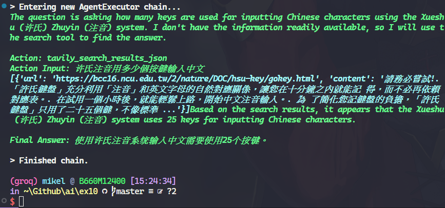

# 習題十

**修改[ ReAct | 🦜️🔗 LangChain ](https://python.langchain.com/v0.1/docs/modules/agents/agent_types/react/)**

`TAVILY_API_KEY` 和 `GROQ_API_KEY` 分別設在環境變數 `$Env:TAVILY_API_KEY` 和 `$Env:GROQ_API_KEY`

執行結果：  

