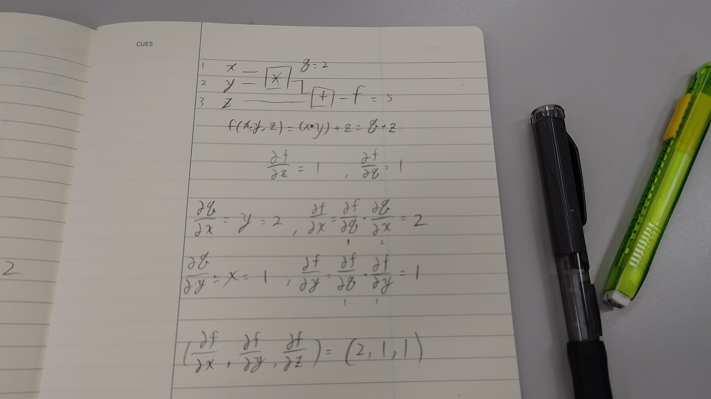

# 期末作業

## [ 習題一 ](../ex1)

不會寫排課系統，所以寫老師推薦的旅行推銷員問題。

* 參考：
    * [tsp.py](https://github.com/ccc112b/py2cs/blob/master/03-人工智慧/02-優化算法/01-傳統優化方法/01-優化/01-爬山演算法/03-通用的爬山框架/tsp.py)
    * [hillClimbing.py](https://github.com/ccc112b/py2cs/blob/master/03-人工智慧/02-優化算法/01-傳統優化方法/01-優化/01-爬山演算法/03-通用的爬山框架/hillClimbing.py)

## [ 習題二 ](../ex2)

還是旅行推銷員問題。

* 參考：
    * [tsp.py](https://github.com/ccc112b/py2cs/blob/master/03-人工智慧/02-優化算法/01-傳統優化方法/01-優化/01-爬山演算法/03-通用的爬山框架/tsp.py)
    * [hillClimbing.py](https://github.com/ccc112b/py2cs/blob/master/03-人工智慧/02-優化算法/01-傳統優化方法/01-優化/01-爬山演算法/03-通用的爬山框架/hillClimbing.py)

## [ 習題三 ](../ex3)

線性規劃

* 參考：
    * [ 李易的程式 ](https://github.com/LeeYi-user/ai/blob/master/homework/03/linear.py)

## 習題四

## [ 習題五 ](../ex5)

參考[ 李易的程式 ](https://github.com/LeeYi-user/ai/blob/master/homework/05/gd.py)，修改老師的[ gd.py ](https://github.com/ccc112b/py2cs/blob/master/03-人工智慧/02-優化算法/02-深度學習優化/03-梯度下降法/gd.py)

## 習題六

還沒寫

## [ 習題七 ](../ex7)

修改自老師的[ lenetRelu.py ](https://github.com/ccc112b/py2cs/blob/master/03-人工智慧/05-神經網路/02-深度學習/01-MNIST/lenetRelu.py)和[ train.py ](https://github.com/ccc112b/py2cs/blob/master/03-人工智慧/05-神經網路/02-深度學習/01-MNIST/train.py)

## [ 習題八 ](../ex8)

修改自[ cartpole_human_run.py ](https://github.com/ccc112b/py2cs/blob/master/03-人工智慧/06-強化學習/01-強化學習/01-gym/04-run/cartpole_human_run.py)

## [ 習題九 ](../ex9)

修改自[ groqChat.py ](https://github.com/ccc112b/py2cs/blob/master/03-人工智慧/A4-groq/hello/groqChat.py)

## 習題十

還沒寫

## [ 習題十一 ](../ex11)

只畫了個棋盤，沒辦法判斷棋子走位是否正確，也不能吃子，更沒有AI。